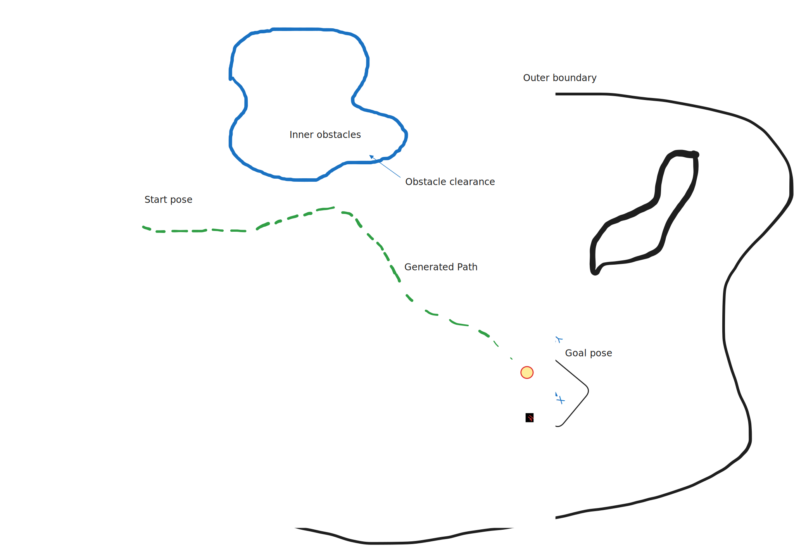

# p2p_planning (Point-to-Point Path Planning)

## Objective
Design and implement a 2D path planning library that computes **collision-free, kinematically feasible** paths for robots operating within a **geofenced environment**. The geofence is provided as a **GeoJSON** file containing the workspace boundary and internal obstacles. The planner must consider the robot's **physical footprint** and **motion constraints** when generating paths.

The library must provide a **Python interface**, with performance-critical components optionally implemented in **C++ via Cython**.



## Implementation Details
* Must expose a Python API as described in `p2p_planner.py`
* If using C++ for performance, must be integrated using Cython.
* Utils to convert between lat/lon and utm (cartesian coordinates) has been provided in `p2p_planning/utils.py`
* Code should be:
   * Modular and easy to extend
   * Fully documented
   * Follows standard Python style guide
   * Tested with automated unit tests. (checkout [tests](./tests/))
* Sample geofence data is provided in `tests/data/`

## Submission Evaluation Criteria
Submission will be evaluated based on the following:
* If it connects start and end pose.
* Path is collision free.
* Path follows robot kinematic constraints.
* Length of the path (whether it is optimal or not).
* Time and compute it takes to generate the path.
* If relevant tests are present to check these criteria.

## Getting Started

1. **Create a local Python virtual environment (.venv) and activate it**
   ```bash
   python3 -m venv .venv
   source .venv/bin/activate
   ```

2. **Install project dependencies in editable mode**
   ```bash
   pip install -e .
   ```

3. **Run tests**
   ```bash
   pytest -v
   ```

4. **Visualize**
   ```bash
   python3 -m tests.visualize --help
   ```