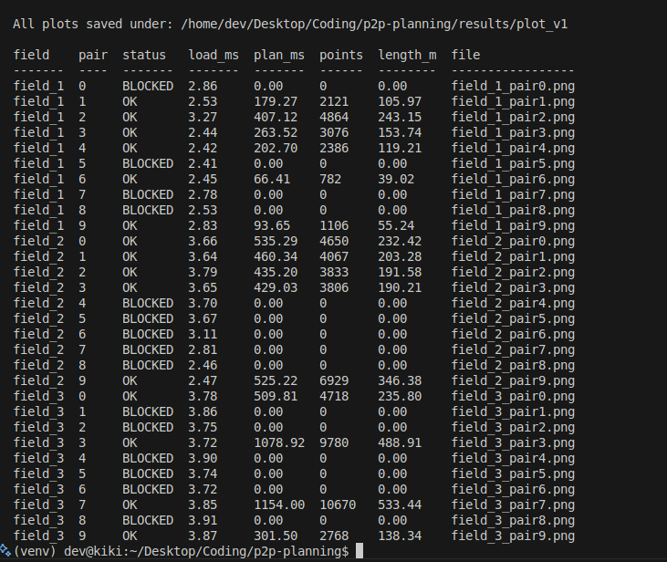

# p2p_planning (Point-to-Point Path Planning) of a Robot

- A library for 2D **robot path planning** inside a **geofenced** environment.  
- It loads **GeoJSON** maps (outer boundary + inner holes/obstacles), converts everything to **UTM meters**, and computes collision-free paths, kinematically feasible that respect **robot footprint** and **clearance** constraints.
- A CLI visualizer lets you render maps, start/goal poses, and planned paths (PNG output).

## Task Overview

Design and implement a planner that, given:
- A **geofence** (outer boundary and internal obstacles/holes) provided as **GeoJSON**, and
- **Start** and **Goal** robot poses: `(latitude, longitude, bearing_deg)`

Produces a **collision-free**, **kinematically feasible** path:
- honoring the robot **footprint** (width, front/rear lengths),
- maintaining a minimum **obstacle clearance**, and
- respecting the robot’s **turning limit** via `max_curvature = 1 / R_min`.

The path is returned as a list of `(lat, lon, bearing_deg)` samples.

⚠️ Current implementation includes a **baseline straight-line planner** with full footprint/clearance checks. 

## Approach Used Till Now:
- **Map ingest:** Parse GeoJSON (Polygon/MultiPolygon/FeatureCollection). Pick the largest outer ring as boundary; treat inner rings (and other outers) as obstacles. Convert all vertices to **absolute UTM meters** and cache `utm_zone` + `band`.
- **Footprint & clearance:** Use a fast, conservative **enclosing circle** for the rectangular robot footprint; require distance to all polygon edges ≥ (robot_radius + clearance).
- **Baseline planner:** Try a **straight-line** segment from start→goal, sampled at `path_resolution`; reject if any sample violates boundary/obstacle/clearance. Convert path back to `(lat, lon, bearing)`.
- **Visualization:** CLI to render boundary, holes, start/goal headings, and path; supports **batch** across all datasets and prints a compact **summary table**.

- Curved planning (Dubins / Reeds-Shepp / PRM / Hybrid-A*) is the next milestone.

## Challenges
- **Coordinate discipline:** Enforce a single **UTM zone/band**; validate start/goal against the map to prevent silent distortions.
- **Clearance modeling:** Balance speed vs fidelity; enclosing circle is safe and fast, but conservative.
- **Bearing conventions:** CSV = **0° North, clockwise**; internal ENU yaw is CCW radians—convert consistently.
- **Baseline limits:** Straight lines fail when obstacles intervene; requires curved, obstacle-avoiding motion.

## Progress so far
- ✅ **GeoJSON→UTM** loader with boundary/holes and zone/band caching.
- ✅ **Straight-line** planner with footprint + clearance checks and clear errors.
- ✅ **Visualizer**: single + batch, PNG output to `results/plot_v1/`, terminal **table** with load/plan time, points, length.
- ✅ Batch results show ~**50%** pairs succeed with straight lines; the rest are **BLOCKED** (as expected).

    

## Next steps (concise)
1. **Curved local planner:** Implement **Dubins** (no reverse) and/or **Reeds–Shepp** (with reverse), using `R_min = 1 / max_curvature`.
2. **Global search:** Add **PRM** or **Hybrid A\***—sample (x,y,θ), connect neighbors via Dubins/RS (reject colliding edges), run A*, sample final curve.
3. **Path improvement:** Shortcut/smooth while preserving clearance & curvature; optional speed profile.
4. **Tests & perf:** Unit tests for `plan()` (success/failure/clearance), profiling, spatial indexing or Cython/C++ for hot loops.